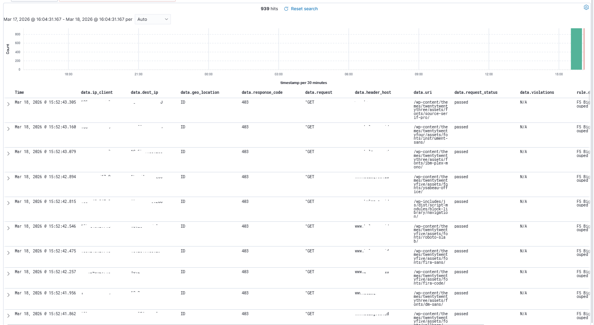
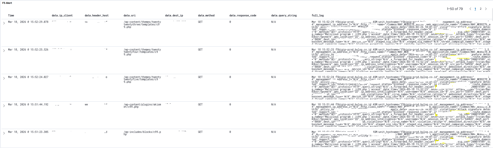
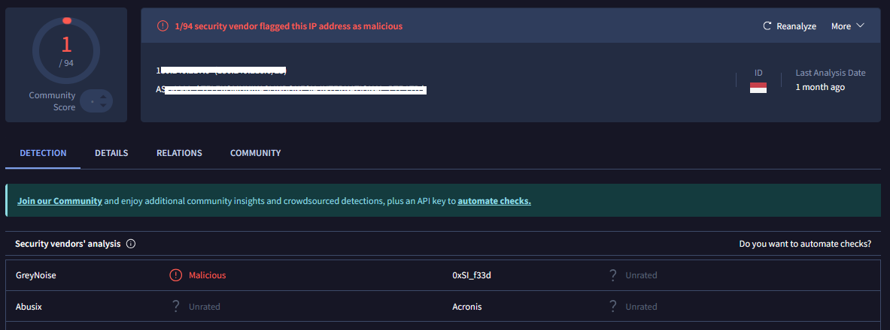
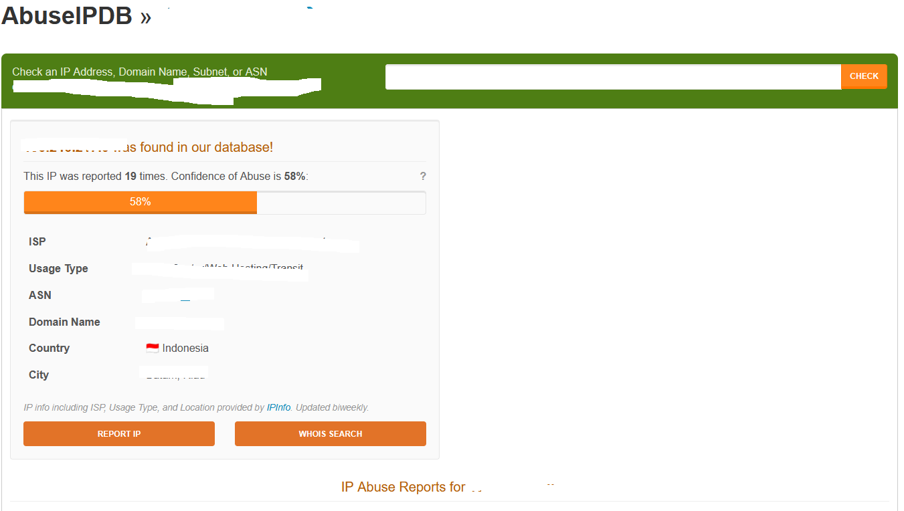

## 🛑 Web Attack & Backdoor Scanning Detection

### 📌 Scenario
Detected suspicious activity from an external IP attempting to scan and access sensitive WordPress files on a public-facing web application.

---

### 🚨 Detection

Alert generated from WAF & SIEM indicating:

- Multiple HTTP GET requests to WordPress directories:
  - `/wp-content/`
  - `/wp-includes/`
- High frequency requests in short time (burst activity)
- Attempt to access known malicious file:
  - `/c99.php` (web shell/backdoor)
- WAF triggered:
  - **Attack signature detected**
  - **Trojan/Backdoor/Spyware pattern**

---

### 🔍 Analysis

#### Indicators of Attack
- Repeated requests from single IP: `180.x.x.x`
- Enumeration of WordPress structure
- Access attempt to known web shell file (`c99.php`)

#### Behavior Analysis
- Automated scanning activity
- WordPress targeting
- Pre-exploitation and possible backdoor deployment attempt

---

### 🌐 Threat Intelligence Enrichment

External threat intelligence validation:

- Checked IP reputation via AbuseIPDB
- Verified indicators using VirusTotal

#### Findings:
- IP reported multiple times for:
  - Web attack
  - Brute force
  - Bot activity
- Abuse Confidence Score: **58%**
- Classified as **suspicious / potentially malicious source**

---

### 🧠 Threat Classification

Mapped to MITRE ATT&CK:

- T1595 – Active Scanning
- T1190 – Exploit Public-Facing Application
- T1505 – Server Software Component (Web Shell)

---

### ⚡ Response

- Request blocked by WAF (automatic protection)
- Monitored repeated attack attempts
- Validated threat via threat intelligence
- Escalated incident for further review

---

### 🛡 Mitigation

- Ensure no sensitive files (e.g., c99.php) exist on server
- Harden WordPress configuration
- Enable strict WAF blocking rules
- Monitor repeated scanning activity

---

### 📊 Outcome

- Attack successfully detected and blocked
- No evidence of successful compromise
- Improved detection visibility for web attacks

- ### 📸 Evidence

#### 1. WAF Detection Logs
WAF logs showing multiple requests to WordPress directories and detection of malicious patterns.

---

#### 2. Raw Attack Logs (c99.php Attempt)
Detailed logs showing attacker attempting to access known web shell file `/c99.php`.

---

#### 3. Threat Intelligence – VirusTotal
IP analysis showing detection from security vendors indicating suspicious/malicious activity.

---

#### 4. Threat Intelligence – AbuseIPDB
IP reputation data showing multiple abuse reports and high confidence of malicious activity (58%).

