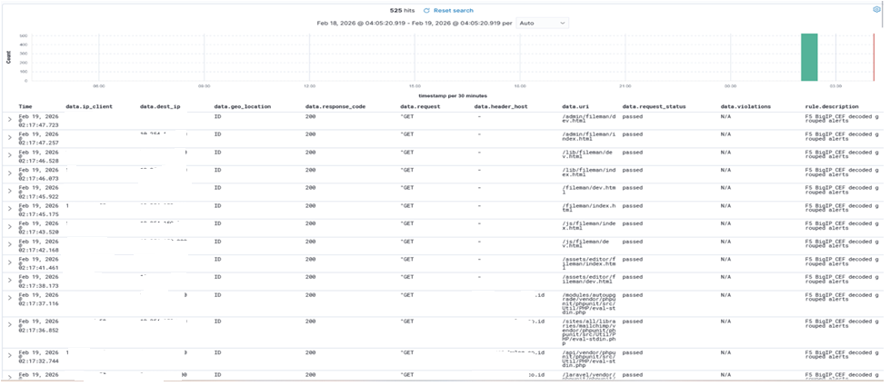
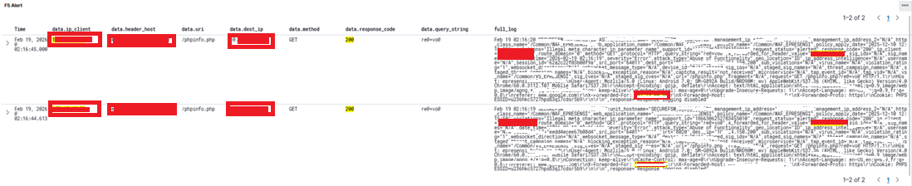
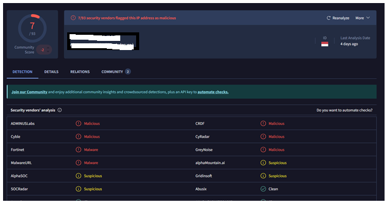
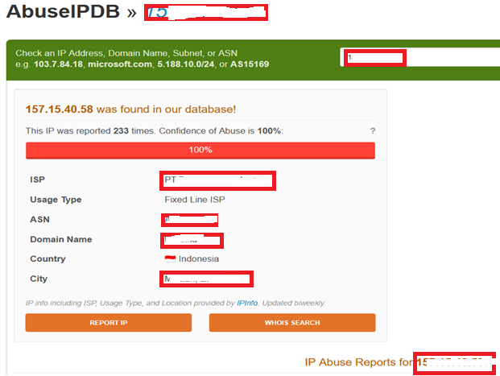

# 🛑 Web Recon & Exploit Attempt Detection

## 📌 Scenario
Detected suspicious reconnaissance and exploitation attempts targeting a public-facing web application from an external attacker.

---

## 🚨 Detection
Alert generated from WAF & SIEM indicating:
- Suspicious request to sensitive endpoint `/phpinfo.php`
- Malformed query string detected (`re@=vo@`)
- WAF violation: Illegal meta character in parameter

---

## 🔍 Analysis

### Indicators of Attack
- Repeated requests from a single external IP  
- Targeting sensitive endpoint (`phpinfo`)  
- Abnormal query string pattern  

### Behavior Analysis
- Reconnaissance activity (endpoint probing)  
- Attempt to identify vulnerable parameters  
- Possible pre-exploitation phase  

---

## 🌐 Threat Intelligence Enrichment

To validate the attacker reputation, external threat intelligence platforms were used:

- Checked attacker IP reputation using AbuseIPDB  
- Verified indicators using VirusTotal  
- Correlated findings with SIEM alerts to confirm malicious activity   

### Findings:
- IP reported for suspicious/malicious activity  
- Classified as potential threat source  

---

## 🧠 Threat Classification
Mapped to MITRE ATT&CK:
- T1595 – Active Scanning  
- T1190 – Exploit Public-Facing Application  

---

## ⚡ Response
- Blocked attacker IP at firewall/WAF level  
- Enabled stricter WAF protection rules  
- Investigated affected endpoints  
- Documented and escalated incident  

---

## 🛡 Mitigation
- Disabled or restricted access to `/phpinfo.php`  
- Implemented stricter input validation  
- Enabled WAF blocking mode  
- Continuous monitoring via SIEM  

---

## 📊 Outcome
- Attack successfully detected and contained  
- No confirmed compromise  
- Improved detection capability and security posture

- ## 📸 Evidence

### SIEM Alert

### WAF Log

### VirusTotal Check

### AbuseIPDB Check

